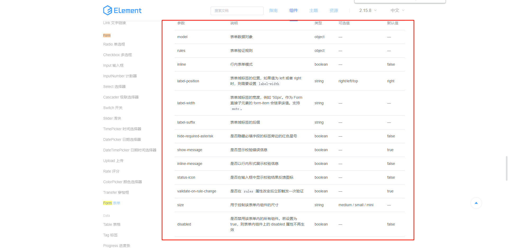
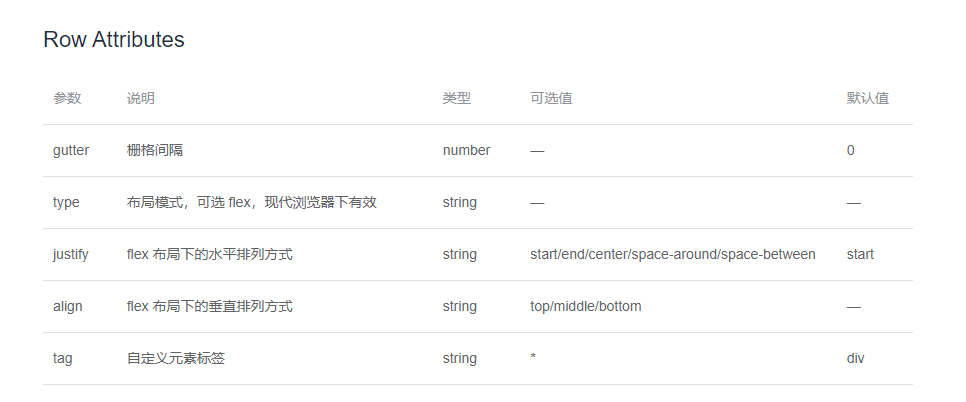
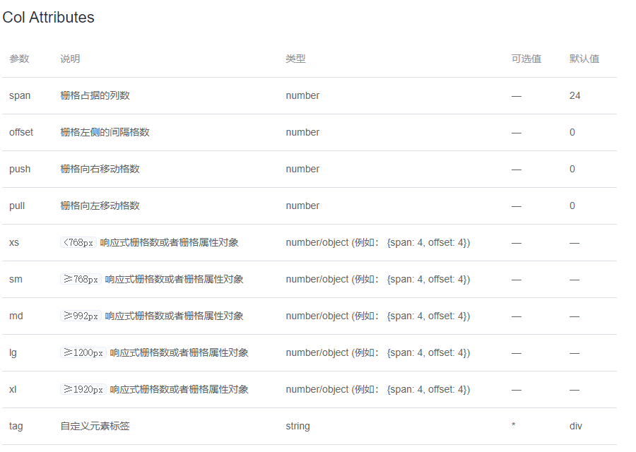
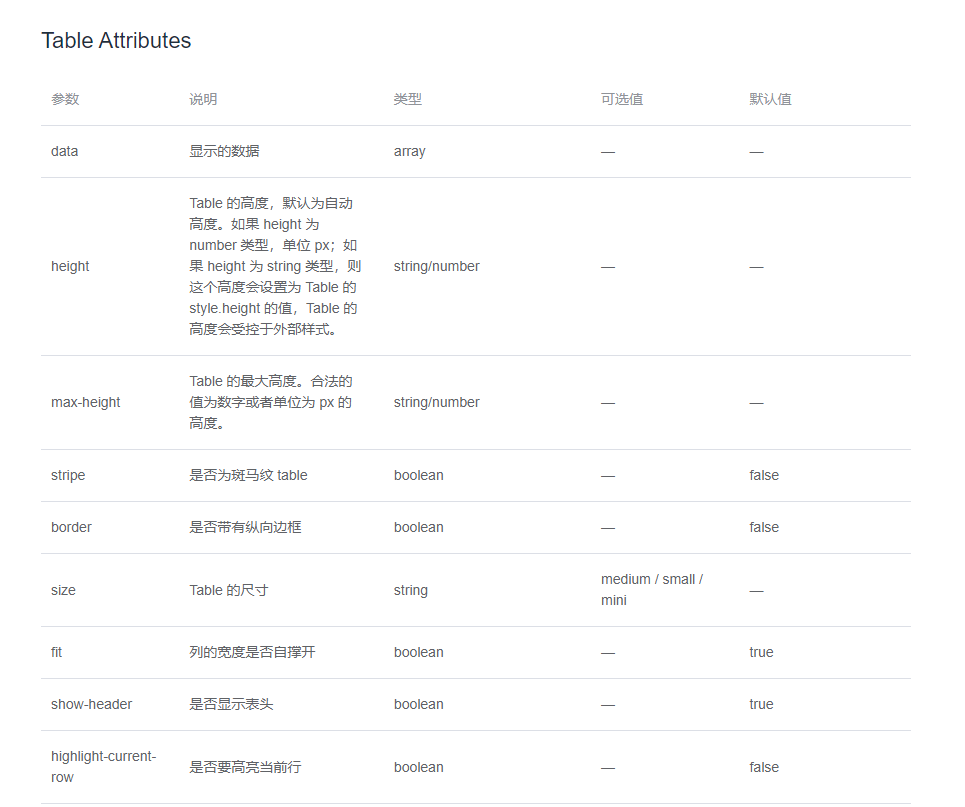
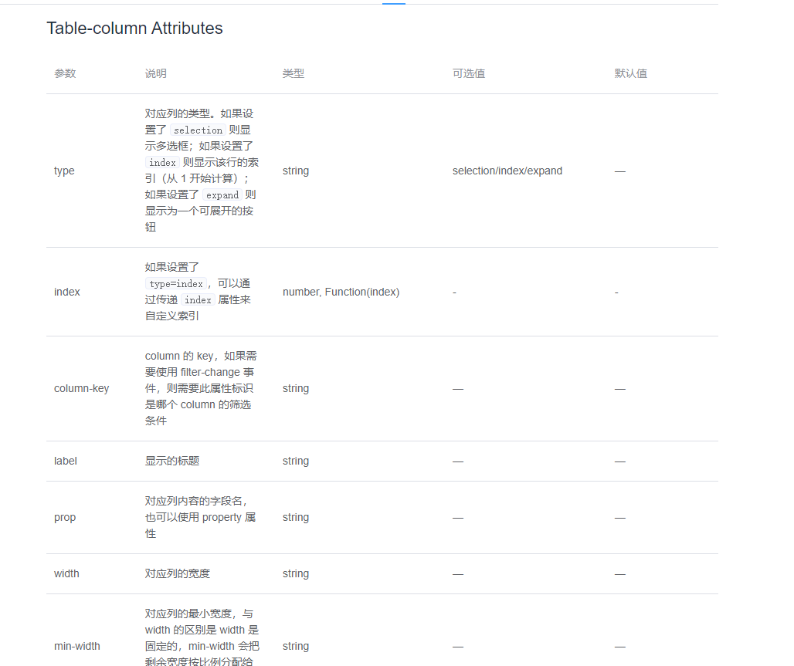
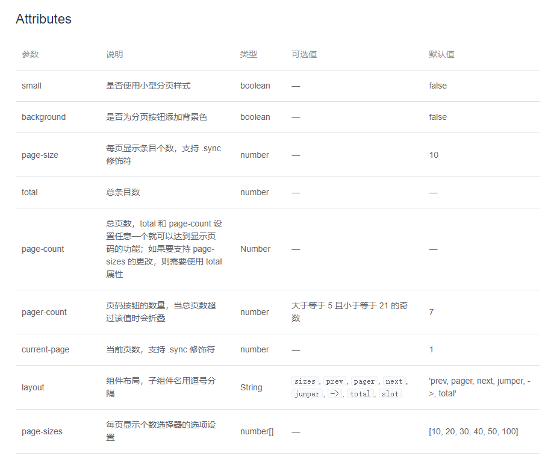

# 基于Vue二次封装的element-ui组件

## 技术栈
<a href="https://github.com/vuejs/vue/tree/v2.6.14">
  
</a>
<a href="https://element.eleme.io/#/zh-CN/component/installation">
  
</a>

## 文件目录
```

│  .babelrc
│  .gitignore
│  index.html
│  package-lock.json
│  package.json
│  README.md
│  rollup.config.build.js
│  rollup.config.dev.js
│  yarn-error.log
│  yarn.lock
│
├─packages
│  ├─d-form
│  │  │  index.js
│  │  │
│  │  └─src
│  │          index.vue
│  │
│  ├─d-overflow-tooltip
│  │  │  index.js
│  │  │
│  │  └─src
│  │          index.vue
│  │
│  ├─d-table
│  │  │  index.js
│  │  │
│  │  └─src
│  │          index.vue
│  │          recuve-table-column.vue
│  │
│  └─d-table-page
│      │  index.js
│      │
│      └─src
│              index.vue
│
└─src
    │  index.js
    │
    └─utils
            getValue.js
            tools.js
```
## 如何安装
* 如果你使用npm
```shell
npm i @dinert/element-ui --save
```
* 或者使用yarn
```shell
yarn add @dinert/element-ui
```

## 如何使用
* 在浏览器中
```html
<body>
  <div id="app">
    <d-table :table="table"></d-table>
  </div>
</body>
<script src="https://cdn.jsdelivr.net/npm/vue@2/dist/vue.js"></script>
<script src="https://cdn.bootcdn.net/ajax/libs/element-ui/2.15.8/index.js"></script>
<script src="https://at.alicdn.com/t/font_3370983_ozossfu4xp.js"></script>
<script src="https://at.alicdn.com/t/font_3373809_s6055kmhlcp.js"></script>
<script src="./dist/bundle.umd.js"></script> 如果你是用npm来安装的，请到node_modules/@dinert/element-ui找到dist下的bundle文件夹
<script>
   const app = new Vue({
    el: '#app',
    data: {
      message: 'hello',
      table: {
        tableColumn: [
          {
            type: 'selection',
            width: 55,
            align: 'center',
            disabled: true
          },
          {
            prop: 'type',
            label: '窗口类型',
            children: [
              {
                prop: 'type1',
                label: '类型A',
                children: [
                  {
                    prop: 'type-a',
                    label: '类型AB'
                  },
                  {
                    prop: 'type4',
                    label: '类型AC'
                  },
                ]
              },
              {
                prop: 'type2',
                label: '类型B'
              }
            ]
          },
          {
            prop: 'name',
            label: '姓名'
          },
          {
            prop: 'code',
            label: '工号'
          },
          {
            prop: 'department',
            label: '部门'
          },
          {
            prop: 'enable',
            label: '大屏显示'
          }
        ],
        data: [{
          'name': 'pppppppppp',
          'type-a': 'a3123123'
        }]
      },
    },
    components: {
      DTable: window['dinert-element-ui'].DTable, // window['dinert-element-ui'] 是我导出的全局变量，可以查看有多少个组件和方法
    }
  })
</script>
```
## 在vue项目中
```html
<template>
  <div>
    <d-table :table="table"></d-table>
  </div>
</template>
<script>
import { DTable } from '@dinert/element-ui'
export default {
  name: 'Test',
  components: {
    DTable
  },
  data() {
    return {
      table: {
        tableColumn: [
          {
            type: 'selection',
            width: 55,
            align: 'center',
            disabled: true
          },
          {
            prop: 'type',
            label: '窗口类型',
            children: [
              {
                prop: 'type1',
                label: '类型A',
                children: [
                  {
                    prop: 'type-a',
                    label: '类型AB'
                  },
                  {
                    prop: 'type4',
                    label: '类型AC'
                  },
                ]
              },
              {
                prop: 'type2',
                label: '类型B'
              }
            ]
          },
          {
            prop: 'name',
            label: '姓名'
          },
          {
            prop: 'code',
            label: '工号'
          },
          {
            prop: 'department',
            label: '部门'
          },
          {
            prop: 'enable',
            label: '大屏显示'
          }
        ],
        data: [{
          'name': 'pppppppppp',
          'type-a': 'a3123123'
        }]
      },
    }
  }
}
</script>
```

## 简述
* 基于Vue二次封装的element-ui组件库，打包成esm、umd、cjs可供浏览器外链、vue的import、node的required的使用形式
* <strong>使用的注意事项</strong>
  1. 在使用的过程中用到函数的几个配置项有`formItem[prop].on、form.on、table.on、table.tableColumn[prop].on、pagination.on...`
  2. 在使用过程中有什么疑问或者修改意见请联系作者

## d-form组件的配置
|   参数    |            说明             |  类型   |               可选值               |                    默认值                    |                                     使用方式                                      |
| :-------: | :-------------------------: | :-----: | :--------------------------------: | :------------------------------------------: | :-------------------------------------------------------------------------------: |
| formItem  |           搜索栏            | Object  |                 ——                 |                      {}                      | ``` {name: {ty2pe: 'input', label: '名称', options: {placeholder: '哈哈哈'} }}``` |
|   form    | element-ui的Form Attributes | Object  |  |                      {}                      |
|    row    |   element-ui的row所有配置   | Object  |    |                      {}                      |                                                                                   |
|           |
| colLayout |       element-ui的col       | Object  |    | ```{ xl: 3, lg: 4, md: 8,sm: 12, xs: 24,}``` |                                                                                   |
| isSearch  | 是否显示右侧的查询重置按钮  | Boolean |             true/false             |                     true                     |


## d-table的配置
|       参数        |                说明                |  类型   |                  可选值                   |                                                                       默认值                                                                        | 使用方式 |
| :---------------: | :--------------------------------: | :-----: | :---------------------------------------: | :-------------------------------------------------------------------------------------------------------------------------------------------------: | :------: |
|    showHeader     |         是否显示头部过滤栏         | Boolean |                true/false                 |                                                                        true                                                                         |          |
|    showFooter     |            是否显示分页            | Boolean |                true/false                 |                                                                        true                                                                         |
|       table       |       element-ui的table配置        | Object  |         |                                                                         {}                                                                          |
| table.tableColumn |    element-ui的table-column配置    |  Array  |  |                                                                         []                                                                          |          |
|     tableSlot     | 是否使用column_ + {prop}的具名插槽 | Boolean |                true/false                 |                                                                        true                                                                         |          |
|     disabled      |              是否禁用              | Boolean |                true/false                 |                                                                         一                                                                          |          |
|    pagination     |     element-ui的patination配置     | Object  |    | ```{currentPage: 1, pageSize: 15,pageSizes: [15, 30, 50, 70, 100],background: true,layout: 'total, sizes, prev, pager, next, jumper',total: 100}``` |
